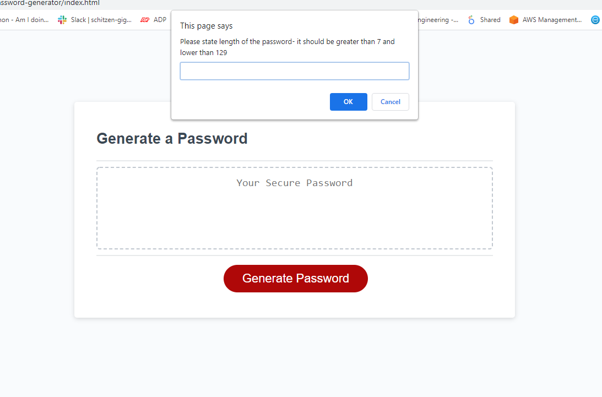
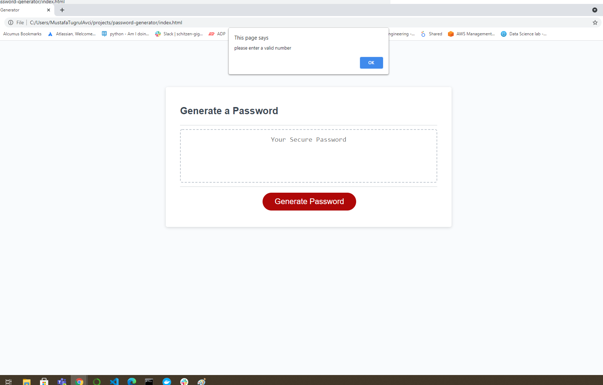
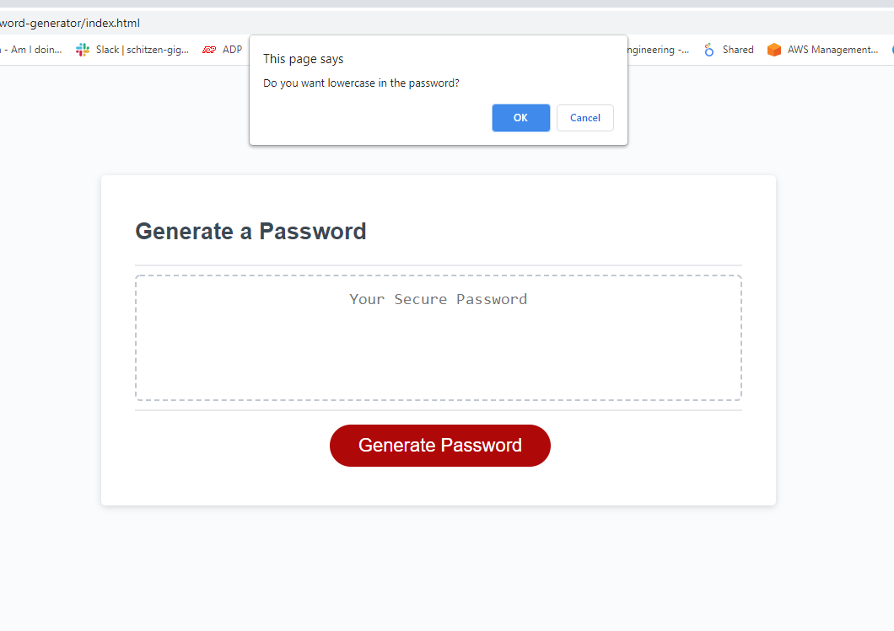

# password-generator

page link : https://mtugrulavci.github.io/password-generator/

Password generator website is generating password when you click on the button with selected criteria,

## Programming Languages

HTML, CSS, JavaScript

## How it functions:

- User clicks on the "Generate Password" button,
  

- User selects the lenght of the password which sould be minimum 8 and no greater than 128, if the entry is not a numberic or null value then system pops up an alert for the user to enter a valid number.
  

- Windows prompths ask if the password contain lower, upper, numeric and special characters. User should choose at least one of the options otherwise system pops up an alert for the user to select at least one of the options.
  

- The created password appears as a windows alert as well as innerHTML text,
  

## License Type

- MIT License
